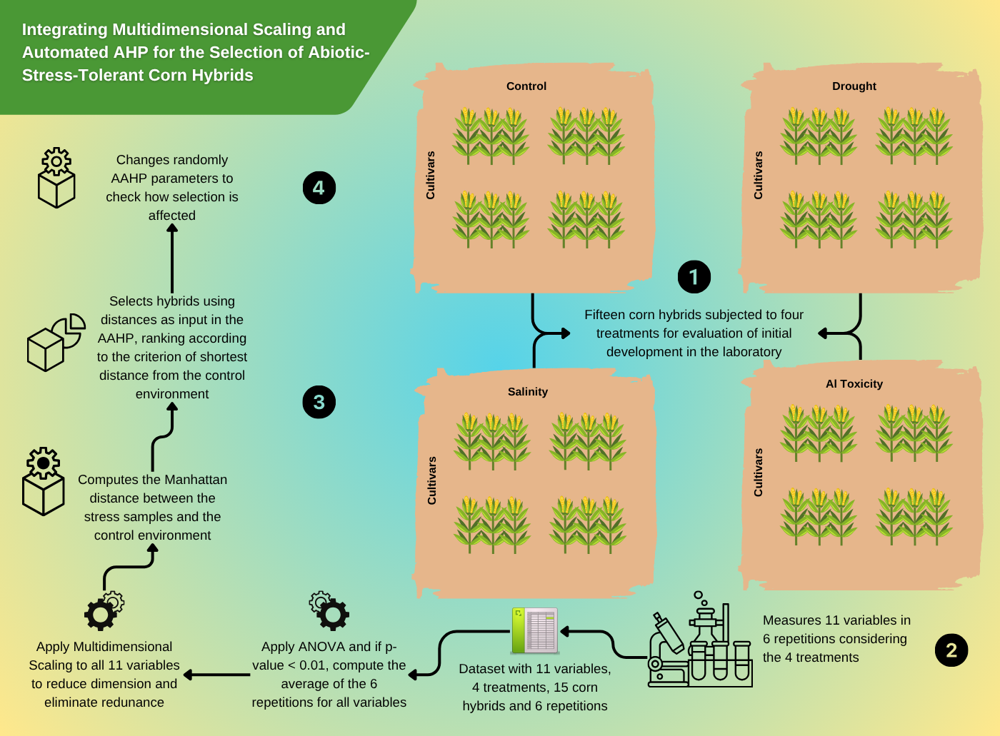

# Integrating Multidimensional Scaling and Automated AHP for the Selection of Abiotic-Stress-Tolerant Corn Hybrids

**Abstract:**
Corn (Zea mays L.) is a vital crop whose productivity is threatened by multiple abiotic stresses, such as drought, salinity, and Aluminum toxicity. Selecting genotypes tolerant to these simultaneous conditions is crucial, but traditional breeding methodologies, which often analyze stresses and variables in isolation, are limited. To address these challenges, this study proposed a decision support system, combining Multidimensional Scaling (MDS) to mitigate multicollinearity and reduce data dimensionality with the Automated Analytic Hierarchy Process (AAHP). This integration allowed the evaluation and ranking of 15 hybrids based on a single tolerance score, reflecting their overall adaptability to stresses. The results revealed that the methodology consistently and stably identified the hybrids ONÇA PRO2, BP 2201 VIP3, and AG 8701 PRO4 as the most tolerant, maintaining their top positions regardless of the MDS application. Crucially, the system demonstrated high internal consistency, evidenced by low Consistency Ratios, and proved robust: the ranking stability for the top hybrids was maintained even across 50,000 simulated scenarios of weight assignment. We conclude that the MDS-AAHP integration provides a reliable, objective, and automated decision-making tool for selecting genotypes adapted to multiple stress scenarios, overcoming the limitations of traditional approaches and ensuring reproducible results.

**Authors:**
Fábio Steiner1,2,* , Bruno Rodrigues de Oliveira3,* , Marco Aparecido Queiroz Duarte1 , Sthela Silva Melo1 , Ruth Teles Barbosa2  , Alan Mario Zuffo4 , Jorge González Aguilera1 , Fabio Ribeiro Barros4 

1 State University of Mato Grosso do Sul (UEMS), Cassilândia, MS, Brazil.

2 State University of Mato Grosso do Sul (UEMS), Aquidauana, MS, Brazil.

3 Pantanal Editora, Nova Xavantina, MT, Brazil.

4 State University of Maranhão (UEMA), Balsas, MA, Brazil.

*Correspondence: steiner@uems.br; bruno@editorapantanal.com.br

